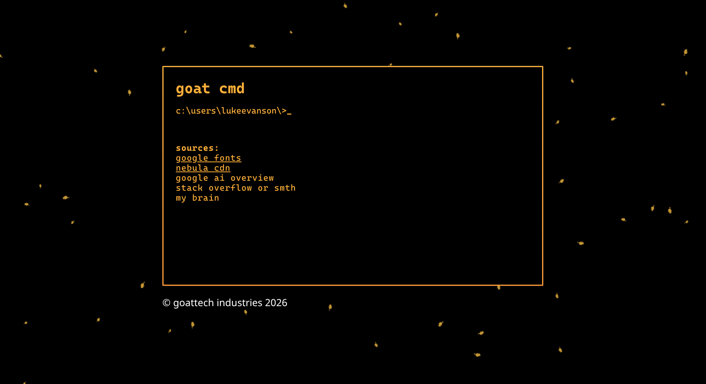
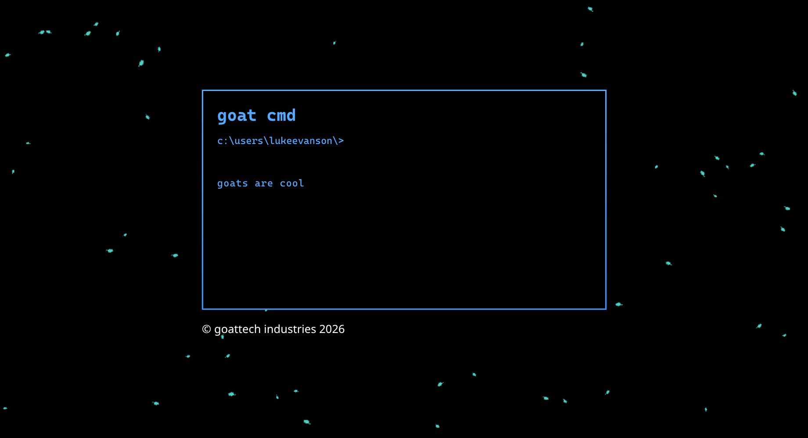
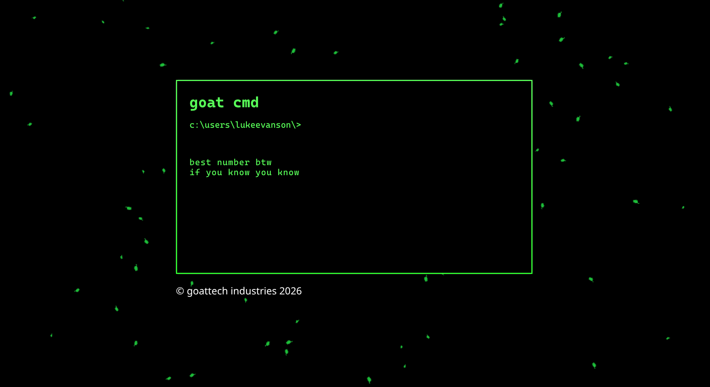
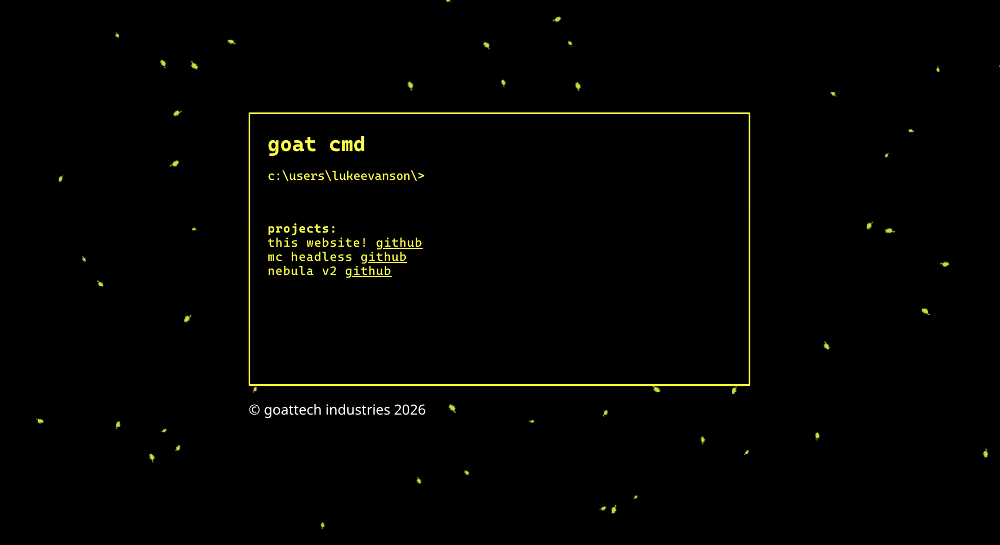

 

</a>
<h3 align="center">my website</h3>

redesigned for the 5th time!
 
and yes everything in lowercase is intentional
 
 
  
<a href="https://lukeevanson.com">the site</a> |
<a href="https://github.com/GoatTech-42/my-website/issues">issues</a>

### Built With

- [HTML](https://html.spec.whatwg.org/)
- [CSS](https://www.w3.org/Style/CSS/Overview.en.html)
- [JS](https://developer.mozilla.org/en-US/docs/Web/JavaScript)

 
<h3>description:</h3>

this is my personal website, meant to show off my skills and projects. it's designed like a command line, and changes colors based on the season. it has cool minecraft falling leaf particles, and you can type commands to see different things about me and easter eggs. easter egg commands can be found by just looking at the code.

<h5>type "help" for help lol</h5>
 
<h3>previews:</h3>

fall colors

winter colors

spring colors

summer colors

 
<h5 align="center">not vibecoded!</h3>
